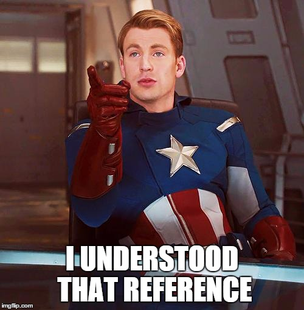

---
output:
  #bookdown::html_document2: default
  #bookdown::word_document2: default
  bookdown::pdf_document2:
    template: templates/brief_template.tex
    citation_package: biblatex
bib-humanities: true
documentclass: book
#bibliography: [bibliography/references.bib, bibliography/additional-references.bib]
---

# Citazioni, referenze incrociate, e collaborazione {#cites-and-refs}
\chaptermark{Citations and cross-refs}
\minitoc <!-- this will include a mini table of contents-->

## Citazioni
Il modo per includere le citazioni in un documento *R Markdown* è inserire i riferimenti in un file di testo normale con estensione **.bib**, in formato **BibTex**.[^bib-formats]
Quindi fai riferimento al percorso di questo file nell'intestazione YAML di **index.Rmd** con `bibliography: example.bib`.

[^bib-formats]: la bibliografia può essere anche in altri formati, inclusi EndNote (**.enl**) e RIS (**.ris**), vedere [rmarkdown.rstudio.com/authoring_bibliographies_and_citations](https ://rmarkdown.rstudio.com/authoring_bibliographies_and_citations.html).

La maggior parte dei gestori di referenze può creare automaticamente un file .bib con le tue referenze.
Tuttavia, il **di gran lunga** miglior gestore di riferimento da utilizzare con *R Markdown* è [Zotero](https://www.zotero.org) con il [plug-in Better BibTex](https://retorque. re/zotero-better-bibtex/), perché il plugin `citr` per RStudio (vedi sotto) può leggere i riferimenti direttamente dalla tua libreria Zotero! 
Ah, dimenticavo, Rmarkdown sistema da sola in ordine alfabetico le referenze ogni volta che fai knit e ne fai riferimento nel testo.

Ecco un esempio di una voce in un file **.bib**:
```bibtex
@article{Shea2014,
  author =        {Shea, Nicholas and Boldt, Annika},
  journal =       {Trends in Cognitive Sciences},
  pages =         {186--193},
  title =         {{Supra-personal cognitive control}},
  volume =        {18},
  year =          {2014},
  doi =           {10.1016/j.tics.2014.01.006},
}
```
In questa sezione evidenziata, 'Shea2014' è l'**identificativo di citazione**.
Il modo predefinito per citare una voce nel testo è con questa sintassi: `[@citation-identifier]`.

Quindi potrai citare alcune referenze così [@Shea2014; @Lottridge2012; @Mill1965].

### Aspetto delle citazioni e della sezione dei riferimenti (pandoc) {#citation-appearance}
Per una impostazione predefinita, `cattolicadown` consente a [Pandoc](https://pandoc.org) di gestire il modo in cui le citazioni vengono inserite nel testo e nella sezione dei riferimenti.
Puoi modificare l'aspetto di citazioni e riferimenti specificando un file CSL (Citation Style Language) nel campo dei metadati `csl` di **index.Rmd**.
Per impostazione predefinita, "cattolica" dell'American Psychological Association APA (7a edizione).

Con questo stile, è utile conoscere una serie di variazioni sulla sintassi della citazione:

- Metti i nomi degli autori fuori parentesi
  - Questo: `@Shea2014 dice bla.`
  - Diventa: @Shea2014 dice bla.
- Includere solo l'anno di citazione (tra parentesi)
  - Questo: `Shea et al. dice bla [-@Shea2014]`
  - Diventa: Shea et al. dice bla [-@Shea2014]
- Aggiungi testo e riferimenti a pagine o capitoli alla citazione
  - Questo: `[vedi @Shea2014, pp. 33-35; anche @Wu2016, cap. 1]`
  - Diventa: bla bla [vedi @Shea2014, pp. 33-35; anche @Wu2016, cap. 1].

Se invece vuoi uno stile di citazione con numero, prova `csl: bibliography/transactions-on-computer-human-interaction.csl` o sfoglia semplicemente il [Zotero Style Repository](https://www.zotero.org/ stili) cercando uno che ti piace.
Per comodità, puoi impostare l'interlinea e lo spazio tra le voci bibliografiche nella sezione di riferimento direttamente dall'intestazione YAML in **index.Rmd**.

Se preferisci usare `bilatex` o `natbib` per gestire i riferimenti, vedi [questo capitolo](#customising-citations).
\clearpage

<!-- clearpage ends the page, and also dumps out all floats.
  Floats are things like tables and figures. -->

### Inserisci facilmente i riferimenti con l'editor visivo di RStudio

Per inserire facilmente le citazioni, usa il [Visual Editor] di RStudio (https://rstudio.github.io/visual-markdown-editing/citations.html).
Assicurati di avere l'ultima versione di RStudio: l'editor visivo originariamente era davvero buggato, specialmente in relazione ai riferimenti, ma v2022.02.0 è fantastico!

## Riferimenti incrociati
Possiamo fare riferimenti incrociati a **sezioni** all'interno del nostro documento, nonché a **figure** (immagini e grafici) e **tabelle**.

La sintassi generale per i riferimenti incrociati è **`\@ref(label)`**

### Riferimenti alla sezione
Alle intestazioni viene assegnata automaticamente un'etichetta di riferimento, che è il testo in maiuscolo separato da trattini. Ad esempio, a `# My header` viene assegnata automaticamente l'etichetta `my-header`. Quindi `# My header` può essere referenziato con `\@ref(my-section)`

Ricordi cosa abbiamo scritto nella sezione \@ref(citations)?

Possiamo anche usare la **sintassi del collegamento ipertestuale** e aggiungere \# prima dell'etichetta, anche se questo è garantito che funzioni correttamente solo nell'output HTML:

- Quindi se scriviamo `Ricordi cosa abbiamo scritto nella [sezione precedente](#citations)?`
- Diventa Ricorda cosa abbiamo scritto nella [sezione precedente](#citations)?

#### Creazione di etichette personalizzate
È un'ottima idea creare **etichette personalizzate** per le nostre sezioni. Questo perché le etichette assegnate automaticamente cambieranno quando cambiamo i titoli delle sezioni - per evitare ciò, possiamo creare noi stessi le etichette e lasciarle intatte se cambiamo i titoli delle sezioni.

Creiamo etichette personalizzate aggiungendo `{#label}` dopo un'intestazione, ad es. `# La mia sezione {#my-label}`.
Vedi [il titolo del nostro capitolo](#cites-and-refs) per un esempio. Quella era la sezione \@ref(cites-and-refs).

### Riferimenti a figure (immagine e grafico).
- Per fare riferimento a figure (ovvero immagini e grafici) utilizzare la sintassi `\@ref(fig:label)`
- **NB**: le figure e le tabelle devono avere didascalie se desideri fare un riferimento incrociato.

Aggiungiamo un'immagine:
```{r captain, fig.align='center', fig.cap="A marvel-lous meme", out.width="65%"}

```

Ci riferiamo a questa immagine con `\@ref(fig:capitano)`.
Quindi la figura \@ref(fig:capitano) è [questa immagine](#fig:capitano).

E nella figura \@ref(fig:cars-plot) vediamo [cars plot](#fig:cars-plot).

### Riferimenti a tabelle
- Per fare riferimento alle tabelle, utilizzare la sintassi `\@ref(tab:label)`

Adeso includiamo la tabella:
```{r cars-table2}
knitr::kable(cars[1:5,],
            caption="Stopping cars")
```

Ci riferiamo a questa tabella con `\@ref(tab:cars-table2)`.
Quindi la tabella \@ref(tab:cars-table2) è [questa tabella](#tab:cars-table2).

E nella tabella \@ref(tab:cars-table) abbiamo visto più o meno [la stessa tabella delle auto](#tab:cars-table).

### Numeri di pagina

Infine, nell'output PDF potremmo anche voler includere il numero di pagina di un riferimento, in modo che sia facile trovarlo nell'output fisico stampato.
LaTeX ha un comando per questo, che assomiglia a questo: `\pageref{fig/tab:label}` (nota: parentesi graffe, non parentesi)

Quando eseguiamo l'output in PDF, possiamo utilizzare LaTeX non elaborato direttamente nei nostri file .Rmd. Quindi se volessimo inserirenil grafico della auto alla pagina potremmo scrivere:

- Questo: `Figura \@ref(fig:cars-plot) nella pagina \pageref(fig:cars-plot)`
- Diventa: Figura \@ref(fig:cars-plot) nella pagina \pageref{fig:cars-plot}

#### Numeri di pagina solo nell'output PDF
Un problema qui è che i comandi LaTeX non vengono visualizzati nell'output HTML, ma anche nell'output di gitbook, da cui osserveremo "Figure \@ref(fig:cars-plot) on page".

Un modo per aggirare questo problema è utilizzare il codice inline per inserire il testo e utilizzare un'istruzione `ifelse` per controllare il formato di output e quindi inserire il testo appropriato solo se conforme al formato desiderato.

- Quindi: `` ``r ''`r ifelse(knitr::is_latex_output(), "Figure \\@ref(fig:cars-plot) on page \\pageref{fig:cars-plot}", "")` ``
- Inserisci questo (verifica che sia solo PDF output): `r ifelse(knitr::is_latex_output(), "Figure \\@ref(fig:cars-plot) on page \\pageref{fig:cars-plot}", "")`

Si noti che è necessario eseguire l'escape della barra inversa con un'altra barra inversa qui per ottenere l'output corretto.

## Scrittura collaborativa

Le migliori pratiche per la collaborazione e il rilevamento delle modifiche quando si utilizza R Markdown sono ancora una questione aperta.
Nel post del blog [**One year to dissertate**](https://livefreeordichotomize.com/2018/09/14/one-year-to-dissertate/) di Lucy D'Agostino, che consiglio vivamente, l'autorice unisce i file .Rmd a un documento di Word, quindi utilizza il pacchetto "googledrive" R per inviarlo a Google Drive per commenti / revisioni dai coautori, quindi incorpora i suggerimenti di Google Drive *a mano* nel sorgente .Rmd File.
Questo approccio è un po' goffo e ci sono discussioni in corso tra gli sviluppatori di _R Markdown_ su quale sia il modo migliore per gestire la scrittura collaborativa (vedi [numero #1463](https://github.com/rstudio/rmarkdown/issues/1463) su GitHub, dove [CriticMarkup](http://criticmarkup.com) è tra i suggerimenti).

Per ora, questa è una domanda aperta nella comunità degli utenti di R Markdown.
Spesso lavoro a un formato che può essere facilmente importato in Google Docs per i commenti, quindi esamino le revisioni suggerite e le reinserisco manualmente nei file di origine .Rmd.
Per gli articoli, a volte carico una bozza quasi definitiva su [Overleaf](https://www.overleaf.com/), quindi apporto in modo collaborativo le modifiche finali al file LaTeX lì.
Sospetto che qualche grande soluzione sarà sviluppata in un futuro non troppo lontano, probabilmente dal team di RStudio.

## Risorse addizionali

- *R Markdown: The Definitive Guide* - <https://bookdown.org/yihui/rmarkdown/>

- *R for Data Science* - <https://r4ds.had.co.nz>