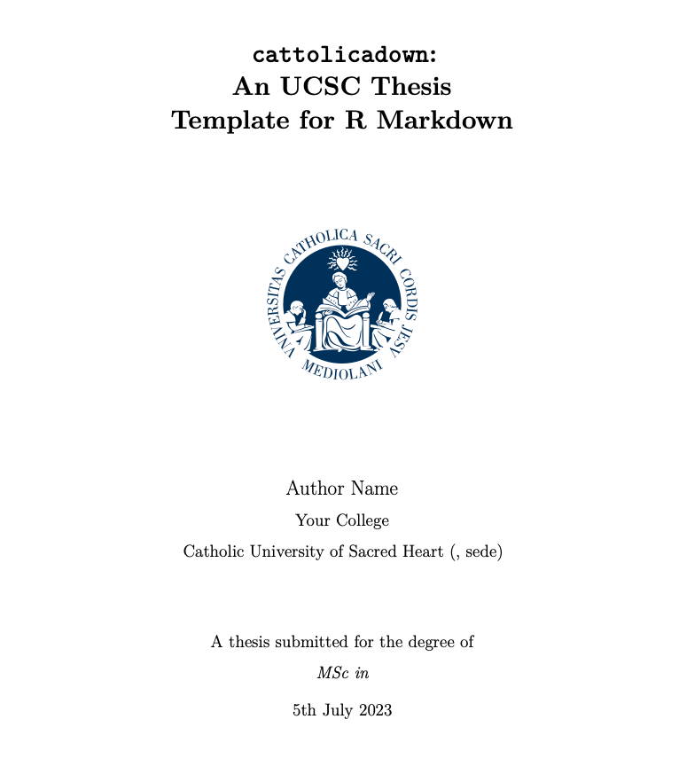

# Per citarmi!
Se usi questo template per scrivere la tua tesi, citalo! :smiling_face_with_three_hearts:
Sto correggendo refusi e sintassi per la [documentazione online](https://cattolicadown.netlify.app/), quindi se hai suggerimenti lasciameli per favore. Il modo più facile per farlo è annotare sulla costa sx del sito di `cattolicadown`, infatti dovresti vedere un plug-in (una piccola linguetta), si chiama **hypothes**, serve appunto per annotare pagine web, lasciami un commento se puoi. Settimanalmente li rivedo e aggiorno.

**EDIT DOI**

[](10.5281/zenodo.3484681)
 
 
**EDIT DOI**

``` bibtex
@misc{cattolicadown2022,
  author = {Salvini, Niccolò},
  title = {cattolicadown: An UCSC Thesis Template for R Markdown},
  year = {2022},
  publisher = {GitHub},
  journal = {GitHub repository},
  howpublished = {\url{https://cattolicadown.netlify.app/}},
  doi = {10.5281/zenodo.3484681},
}
```

# Contents

-   [Requirements](#requisiti)
-   [How to use](#cosa-devo-fare?)
    -   [How-to chapters](#how-to-chapters)
    -   [Video tutorials](#video-tutorials)
    -   [Writing your thesis](#writing-your-thesis)
    -   [Building your entire thesis](#building-your-entire-thesis)
        -   [PDF output](#pdf-output)
        -   [Gitbook output](#gitbook-output)
        -   [BS4 book output](#bs4-book-output)
        -   [Word output](#word-output)
    -   [Building a single chapter](#building-a-single-chapter)
-   [Customisations and extensions](#customisations-and-extensions)
-   [Limitations](#limitations)
    -   [Gotchas](#gotchas)
    -   [Output formats](#output-formats)

# `cattolicadown`

Un modello per scrivere una tesi dell'Università Cattolica del Sacro Cuore (per tutte le sedi) in R Markdown.
Il modello utilizza il pacchetto [bookdown](https://bookdown.org) R insieme a [OxThesis LaTeX template](https://github.com/mcmanigle/OxThesis), oltre a molte ispirazioni da [thesisdown](https ://github.com/ismayc/thesisdown) e [oxforddown](https://ulyngs.github.io/oxforddown/) .

-   [Esempio PDF output](https://github.com/NiccoloSalvini/cattolicadown/blob/main/docs/_main.pdf)
-   [Esempio docs BS4 book out](https://NiccoloSalvini.github.io/cattolicadown/)

*NOTA: se hai utilizzato questo modello per scrivere la tua tesi, mandami due righe al [niccolo.salvini@unicatt.it](mailto:niccolo.salvini@unicatt.it) cosicchè lo aggiunga qua e possa essere di esempio!*

## Requisiti

-   [R](https://cran.rstudio.com) e [RStudio version >= 1.2](https://www.rstudio.com/products/rstudio/download/#download)

-  R packages `rmarkdown`, `bookdown`, `tidyverse`, `kableExtra`, e `here`

-   Installazione LaTeX 

    -   Opzione 1: Usa [TinyTeX](https://yihui.name/tinytex/) (a minimal LaTeX installation intended for use with R Markdown)

        -    development version di TinyTex [currently required](https://github.com/ulyngs/oxforddown/issues/4). Da R esegui

        ``` r
        remotes::install_github('yihui/tinytex')
        tinytex::install_tinytex()
        ```

        -   Quindi installa i pacchetti LaTeX usati da `cattolicadown` (lo spazio su disco occupato da TinyTex con i pacchetti richiesti installati è di circa 280 Mb)

        ``` r
        pacchetti_mancanti <- c(
          "appendix", "babel-english", "babel-greek", "babel-latin", 
          "biber", "biblatex", "caption", "cbfonts-fd", "colortbl", "csquotes", 
          "enumitem", "environ", "eso-pic", "fancyhdr", "greek-fontenc", 
          "grfext", "hyphen-greek", "hyphen-latin", "lineno", "logreq", 
          "makecell", "microtype", "minitoc", "multirow", "notoccite", 
          "oberdiek", "pdflscape", "pdfpages", "quotchap", "soul", "tabu", 
          "threeparttable", "threeparttablex", "titlesec", "tocbibind", 
          "trimspaces", "ulem", "units", "utopia", "varwidth", "wrapfig",
          "fvextra", "xurl"
          )
        tinytex::tlmgr_install(pacchetti_mancanti)
        ```

    -   Option 2: Usa una distro casuale di LaTeX 

        -   Mac: download ed installazione MacTeX da [tug.org/mactex/](http://www.tug.org/mactex/) (\~4 gigs)
        -   Windows: download ed installazione MikTex da [miktex.org](https://miktex.org)

-   *Se su Mac*

    -   Strumenti per sviluppatori da riga di comando. Se non li hai già installati, il tuo Mac probabilmente ti chiederà automaticamente di installarli. Altrimenti, puoi installarli aprendo un terminale ed eseguendo `xcode-select --install`

## Cosa devo fare?

-   clicca sul pulsante verde **Use this template**
-   crea la tua repository della tesi (come se tu la mettessi su drive)
-   successivamente apri un progetto R clonando la Repo (questo passaggio ti sarà più chiaro nella documentazione)
-   apri **cattolicadown.Rproj** in RStudio e sei pronto a scrivere!

### How-to Capitoli
Leggi il [capitolo 'How-to'](https://NiccoloSalvini.github.io/cattolicadown/how-to-use.html) per comprendere lo scheletro di `cattolicadown` e come fare le cose di base come costruire la tua tesi.

Riguardo l'utilizzo di R Markdown e sintassi, e in generale in `cattolicadown` in particolare, leggere i capitoli dedicati a questo ([Nozioni di base su R Markdown](https://cattolicadown.netlify.app/rmd-basics.html), [Citazioni, riferimenti incrociati e collaborazione](https://cattolicadown.netlify.app/cites-and-refs.html) e [Tabelle](https://cattolicadown.netlify.app/tables.html)).

Vedi anche le risorse generali e ufficiali di R Markdown [*R Markdown: The Definitive Guide*](https://bookdown.org/yihui/rmarkdown/) e il [*R Markdown Cookbook*](https://bookdown.org /yihui/rmarkdown-cookbook/).

### Video tutorials

Sto aggiornando i video tutorial  - Ho notato di seguito che devono ancora essere aggiornati, ma sono ancora informativi e ho cancellato quelli che non si applicano più. Non sono a cura mia, ma sto pianificando di metterli! 

- [Part 1: Building the entire thesis](https://youtu.be/LBHxcuCMjnk)
- [Part 2: Building a single chapter](https://youtu.be/8vcO252Us6g)
- [(*old but informative*) Part 3: Understanding the file structure](https://www.youtube.com/watch?v=jafgJobOgpc)
- [(*old but informative*) Part 4: A walk-through example of creating your thesis](https://www.youtube.com/watch?v=uWpinaVSZ6Q)
- [~~Part 5: The content included in index.Rmd (or: why the introduction chapter is special)~~](https://www.youtube.com/watch?v=FPlwCj5ZH8M)
- [(*old but informative*) Part 6: Adjusting the order of chapters](https://www.youtube.com/watch?v=-0M3TuDnu7Y)
- [(*old but informative*) Part 7: \_bookdown.yml: Adjusting build settings](https://www.youtube.com/watch?v=jXYfC8RXTvg)
- [~~Part 8: Makefile: Adjusting build settings~~](https://www.youtube.com/watch?v=L6mV8z32RfE)
- [(*old but informative*) Part 9: The LaTeX templates](https://www.youtube.com/watch?v=o2fd_O1On7g)


### Linee guida formattazione defualt

la tesi dhe compili tramite questo strumento ha questa geometria:
- margine sinitro:  4cm
- margine destro:   3cm
- margine basso:    3cm
- margine alto:     3cm

E' "twoside", nel senso che nelle pagine dispari il margine sinitro è 4cm e il destro 3cm, nelle pari invece è il dx che è 4cm e il sx 3cm. Se vuoi intervenire nella formattazione generale cambia il parametro a `page-layout: nobind` in `index.Rmd` per margini a:

- margine sinitro: 3.1cm
- margine destro:  3.1cm
- margine basso:   2.7cm
- margine alto:    2.5cm


### Scrivere la tesi

- aggiorna l'intestazione YAML (quella in alto tra '---') in **index.Rmd** con il tuo nome, scuola, ecc.
- scrivi i singoli capitoli come file **.Rmd** nella cartella principale (root dir)
- scrivere i preliminari i.e. prelims, tutto cioò che viene prima del della vera e propria tesi (abstract, ringraziamenti, abbreviazioni) e l'ultimo argomento (appendici) regolando i file **.Rmd** nella cartella **front-and-back-matter/**

**I files .Rmd** che non si desidera siano inclusi nel corpo del testo devono avere nomi di file che iniziano con un trattino basso (ad es. **front-and-back-matter/\_abstract.Rmd** e **front- e-back-matter/\_acknowledgements.Rmd**).
(In alternativa, specifica manualmente in **\_bookdown.yml** quali file devono essere uniti nel corpo del testo.)

### 🛠️ builda la tesi

- builda l'intera tesi aprendo **index.Rmd** e facendo clic sul pulsante 'knit'.
- I file di tesi generati vengono salvati nella cartella **docs/**
- Per scegliere i formati di output, vai all'inizio dell'intestazione YAML di **index.Rmd** e modifica la riga `thesis_formats <- "pdf";` nel formato desiderato (le opzioni sono "pdf", "bs4", "gitbook" e "parola")
- Puoi creare più formati contemporaneamente con, ad esempio, `thesis_formats <- c("pdf", "bs4", "word")`
- Se vuoi personalizzare la funzione build, modifica in **scripts_and_filters/knit-functions.R**

#### PDF output

``` yaml
knit: (function(input, ...) {
    thesis_formats <- "pdf";
    ...
```



Quando crei l'intera tesi in PDF, Latex genera un intero gruppo di file ausiliari: questi vengono automaticamente rimossi al termine del processo di creazione dalla funzione di unione personalizzata che viene utilizzata quando fai knit **index.Rmd**.

Per modificare il modo in cui viene eseguita questa rimozione, modifica **scripts_and_filters/knit-functions.R**.
La riga `file.remove(list.files(pattern = "*\\.(log|mtc\\d*|maf|aux|bcf|lof|lot|out|toc)$"))` all'interno di `if ( "pdf" %in% output_format){` è quello che rimuove i files dopo la generazione dell'output PDF.

#### BS4 output (HTML)

``` yaml
knit: (function(input, ...) {
    thesis_formats <- "bs4";
    ...
```

- NOTA: l'[output del libro bs4](https://pkgs.rstudio.com/bookdown/reference/bs4_book.html) richiede i pacchetti R `downlit` e `bslib` (installali con `install.packages`)
- NOTA: per distribuire un libro BS4 su GitHub Pages, ci deve essere un file **.nojekyll** nella cartella **docs/**, altrimenti GitHub fa della magia nera ottenendo che alcuni (random) percorsi di file non funzionino. Questo file è generato automaticamente dalla funzione knit `cattolicadown`.

#### Gitbook output (HTML)

``` yaml
knit: (function(input, ...) {
    thesis_formats <- "gitbook";
    ...
```

- NOTA: per distribuire un libro Gitbook su GitHub Pages, ci deve essere un file **.nojekyll** nella cartella **docs/**, altrimenti GitHub fa della magia nera ottenendo che alcuni (random) percorsi di file non funzionino. Questo file è generato automaticamente dalla funzione knit `cattolicadown`.

#### Word output

``` yaml
knit: (function(input, ...) {
    thesis_formats <- "word";
    ...
```

- Nota che l'output di Word non ha template dietro e molte cose non funzionano (ad es. rotazione dell'immagine, correzioni di evidenziazione). **Incoraggio le richieste pull che ottimizzano l'output di Word, ad es. utilizzando gli strumenti del pacchetto [`officer`](https://github.com/davidgohel/officer).**

### Building a single chapter

Per knit-are un singolo capitolo senza compilare l'intera tesi:

1. aprire il file **.Rmd** di un capitolo
2. aggiungi un'intestazione YAML specificando i formati di output (ad es. `bookdown::word_document2` per un documento di Word che potresti voler caricare su Google Docs per il feedback dei collaboratori)
3. fare clic sul pulsante `knit` (il file di output viene quindi salvato nella cartella principale) output, ad es. utilizzando gli strumenti del pacchetto 

Come mostrato nelle intestazioni YAML dei capitoli di esempio, per generare un singolo capitolo in PDF, utilizzare ad esempio:

``` yaml
output:
  bookdown::pdf_document2:
    template: templates/brief_template.tex
    citation_package: biblatex
documentclass: book
bibliography: references.bib
```

Il file **templates/brief_template.tex** formatta il capitolo nello stile OxThesis ma senza includere la parte iniziale (indice, abstract, ecc.).

**NOTA:** Il percorso bibliografico nelle intestazioni YAML dei singoli capitoli deve essere identico a quello in **index.Rmd** - altrimenti il percorso bibliografico dei singoli capitoli potrebbe sovrascrivere il percorso in **index.Rmd** e causare problemi fai knit dell'intera tesi.

## Personalizzazioni ed estensioni

- per le cose comuni che potresti voler fare nella tua tesi, leggi il contenuto di esempio
- il [capitolo 'Personalizzazioni ed estensioni'](https://NiccoloSalvini.github.io/cattolicadown/customisations-and-extensions.html) (contiene suggerimenti su come includere pagine PDF da una composizione pubblicata articolo nella tua tesi e molto altro!

## Limitazioni

### Gotchas

-   don't use underscores (\_) in your YAML front matter or code chunk labels!
    (underscores have special meaning in LaTeX, so therefore you are likely to get an error, cf. <https://yihui.org/en/2018/03/space-pain/>)

    -   bad YAML: `bibliography: bib_final.bib`
    -   good YAML: `bibliography: bib-final.bib`
    -   bad chunk label: `{r my_plot}`
    -   good chunk label: `{r my-plot}`

### Formati di Output

- al momento solo l'output PDF e HTML è stato correttamente implementato; Potrei migliorare l'output di Word più avanti.

Enjoy!
